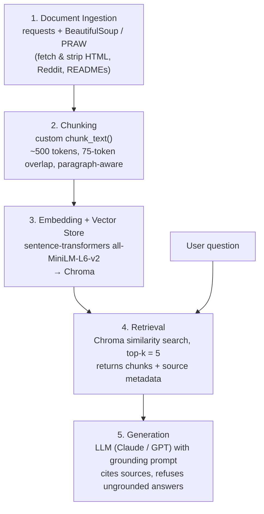

# Project 1 Planning: The Unofficial Guide

> Write this document before you write any pipeline code.
> Your spec and architecture diagram are what you'll use to direct AI tools (Claude, Copilot, etc.) to generate your implementation — the more specific they are, the more useful the generated code will be.
> Update the Retrieval Approach and Chunking Strategy sections if you change your approach during implementation.
> Update this file before starting any stretch features.

---

## Domain

<!-- What domain did you choose? Why is this knowledge valuable and hard to find through official channels? -->

**Domain: How to get hard-to-get restaurant reservations in NYC.**

This covers the unofficial playbook for landing tables at NYC's most in-demand restaurants — when reservations "drop" and at what exact time, how to use waitlist/Notify features, walk-in and bar-seat timing tricks, third-party sniping tools, the secondary resale market, and the current legal landscape.

This knowledge is valuable and hard to find through official channels because the booking platforms (Resy, Tock, OpenTable) only tell you whether a slot is open *right now*. They don't tell you that Tatiana releases tables 28 days out at noon, that a bar seat is often first-come-first-served, or that buying a reservation on a resale site may now be illegal in New York. That practical knowledge lives scattered across Reddit threads, food-media guides, restaurant help docs, GitHub repos, and news reporting — and it goes stale quickly, which is exactly why a retrieval system over current sources is useful.

---

## Documents

<!-- List your specific sources: URLs, subreddit names, forum threads, or file descriptions.
     Aim for at least 10 sources that together cover different subtopics or perspectives within your domain. -->

| # | Source | Description | URL or location |
|---|--------|-------------|-----------------|
| 1 | Resy — "How to Get the Toughest Restaurant Reservations in New York" | Platform's own strategy guide: drop times, alarms, being online at release | https://blog.resy.com/the-one-who-keeps-the-book/toughest-restaurant-reservations-nyc/ |
| 2 | The Infatuation — "The Toughest Reservations In NYC Right Now (And How To Get Them)" | Editorial guide with restaurant-specific drop windows and walk-in tactics | https://www.theinfatuation.com/new-york/guides/toughest-restaurant-reservations-nyc |
| 3 | r/FoodNYC (subreddit) | Crowd-sourced, NYC-specific firsthand reservation tips and reports | https://www.reddit.com/r/FoodNYC/ |
| 4 | r/finedining (subreddit) | Fine-dining community discussion of booking strategy at high-end spots | https://www.reddit.com/r/finedining/ |
| 5 | Resy Help Desk — "What is Notify and how does it work?" | Official mechanics of the Notify waitlist feature for sold-out times | https://helpdesk.resy.com/what-is-notify-and-how-does-it-work-BJrJzPQLu |
| 6 | Alkaar/resy-booking-bot (GitHub) | Open-source reservation-sniping tool; README explains drop timing and automation | https://github.com/Alkaar/resy-booking-bot |
| 7 | Resy — "What Restaurant Operators Wish You Knew About Reservation Fraud" | Anti-bot enforcement, ML detection, no-show reduction stats | https://blog.resy.com/for-restaurants/restaurant-reservation-fraud/ |
| 8 | Appointment Trader (homepage) | Secondary marketplace to buy/sell coveted reservations; pricing dynamics | https://appointmenttrader.com/ |
| 9 | NBC News — "Reservations at top NYC restaurants are selling for hundreds of dollars" | Reporting on the resale economy and which restaurants command premiums | https://www.nbcnews.com/news/us-news/reservations-top-new-york-city-restaurants-are-selling-hundreds-dollar-rcna151702 |
| 10 | Columbia News Service — "New York Banned Reservation Resales..." | The Restaurant Reservation Anti-Piracy Act and its impact on resale platforms | https://columbianewsservice.com/2025/07/28/new-york-banned-reservation-resales-now-appointment-trader-is-testing-the-law-with-ai/ |

These ten span complementary subtopics: official platform strategy (1, 5, 7), independent food-media guides (2), community/anecdotal knowledge (3, 4), technical automation (6), and the secondary market plus its legal status (8, 9, 10).

---

## Chunking Strategy

<!-- How will you split documents into chunks?
     State your chunk size (in tokens or characters), overlap size, and explain why those
     numbers fit the structure of your documents.
     A review-heavy corpus warrants different chunking than a long FAQ. -->

**Chunk size:** ~500 tokens (≈2,000 characters)

**Overlap:** ~75 tokens (≈15%)

**Reasoning:** The corpus is heterogeneous — long-form editorial guides (sources 1, 2), short Reddit posts and comment threads (3, 4), structured help docs (5), and technical READMEs (6). A single tip is usually self-contained in a few sentences ("Tatiana releases tables 28 days in advance at 12 noon; set multiple alarms"), so 500 tokens is large enough to keep a complete tip — restaurant name, timing, and the action — inside one chunk, but small enough that retrieval stays precise instead of dragging in unrelated paragraphs. The 15% overlap prevents a restaurant name in one chunk from being orphaned from the timing detail that follows it across a boundary. Preprocessing before chunking: strip HTML, navigation, ads, and boilerplate; split first on paragraph and heading boundaries, and only fall back to a fixed-size character split when a single block exceeds the limit. Short Reddit posts shorter than the chunk size are kept whole rather than padded.

---

## Retrieval Approach

<!-- Which embedding model are you using (e.g., all-MiniLM-L6-v2 via sentence-transformers)?
     How many chunks will you retrieve per query (top-k)?
     If you were deploying this for real users and cost wasn't a constraint, what tradeoffs
     would you weigh in choosing a different embedding model — context length, multilingual
     support, accuracy on domain-specific text, latency? -->

**Embedding model:** `all-MiniLM-L6-v2` via `sentence-transformers` (384-dimensional, runs locally, fast and well-suited to short English passages)

**Top-k:** 5

**Production tradeoff reflection:** `all-MiniLM-L6-v2` is the right starting choice — free, local, low-latency, and accurate enough on short English text. If I were deploying this for real users and cost weren't a constraint, I'd weigh a larger hosted model such as OpenAI `text-embedding-3-large` or Voyage's retrieval models. The tradeoffs: (1) **Accuracy on domain-specific text** — bigger models embed jargon like "drop," "Notify," "walk-in," and specific restaurant names more reliably, reducing off-target retrieval. (2) **Context length** — MiniLM truncates at 256 tokens, so longer guide passages lose their tail; a longer-context model would let me embed bigger, more coherent chunks. (3) **Multilingual support** — some reviews and posts aren't in English, and a multilingual model would index them instead of dropping them. (4) **Latency and cost** — hosted models add network round-trips and per-call cost, and (5) introduce an **API/privacy dependency** versus keeping everything local. For a hobby-scale guide, local MiniLM wins; for a production app with paying users, I'd pay for a larger hosted model and accept the latency/cost hit in exchange for better recall on domain terms.

---

## Evaluation Plan

<!-- List your 5 test questions with their expected correct answers.
     Questions should be specific enough that you can judge whether the system's response
     is right or wrong. "What are good dining halls?" is too vague.
     "What do students say about wait times at [dining hall name] during lunch?" is testable. -->

| # | Question | Expected answer |
|---|----------|-----------------|
| 1 | How far in advance do reservations at Tatiana drop, and at what time of day? | 28 days in advance, released at 12 noon. |
| 2 | What is Resy Notify and how does it help me get a sold-out table? | A modern waitlist: you set an alert for a sold-out day/time, and when a cancellation opens a slot, Resy pushes you a notification so you can claim and book it immediately. |
| 3 | What walk-in strategy is recommended for Ha's Snack Bar? | Arrive around 4:45 p.m. before the 5:30 p.m. open to make the first bar seating; arriving after 5 p.m. or with more than a couple of people risks a multi-hour wait. |
| 4 | Is it legal to buy a restaurant reservation on Appointment Trader in New York? | New York passed the Restaurant Reservation Anti-Piracy Act banning unauthorized reservation resale; the platform was shut down under the law and is attempting to relaunch with an AI interface to test it. |
| 5 | If I can't get a table reservation, what's one tactic to still eat at a hard-to-book spot? | Go for bar seating, which is often first-come, first-served and usually lets you order the full menu — arrive at or just before opening time. |

---

## Anticipated Challenges

<!-- What could go wrong? Name at least two specific risks with reasoning.
     Consider: noisy or inconsistent documents, missing source attribution, off-topic
     retrieval, chunks that split key information across boundaries. -->

1. **Time-sensitive facts going stale.** Drop times, restaurant policies, and the legal status of resale platforms change frequently. A chunk that says "Appointment Trader lets you buy a Carbone table" may be retrieved and presented confidently even though the law has since banned it. Mitigation: keep source name and publish date in each chunk's metadata, surface them in the answer, and prefer/weight more recent sources so the user can judge currency.

2. **Conflicting and inconsistent advice across sources.** A Reddit anecdote ("just walk in at 5") may contradict an official help doc or a restaurant's stated policy. Retrieval can return contradictory chunks for the same query, and the model may average them into a confident but wrong consensus. Mitigation: instruct generation to attribute claims to their source and to present disagreement explicitly rather than inventing a single answer.

3. **Restaurant-specific details split across chunk boundaries.** A restaurant name and its exact drop time can land in different chunks, so retrieval returns the timing without the restaurant (or vice versa). The 15% overlap and paragraph-aware splitting are meant to reduce this, but it remains a risk for long, list-style guides — and it's the failure mode I'll watch for first during evaluation.

---

## Architecture

<!-- Draw a diagram of your pipeline showing the five stages:
     Document Ingestion → Chunking → Embedding + Vector Store → Retrieval → Generation
     Label each stage with the tool or library you're using.
     You can use ASCII art, a Mermaid diagram, or embed a sketch as an image.
     You'll use this diagram as context when prompting AI tools to implement each stage. -->



Plain-text fallback:

```
[Sources: Resy, Infatuation, Reddit, GitHub, news]
        |
        v
1. Ingestion (requests + BeautifulSoup / PRAW)
        |
        v
2. Chunking (chunk_text: ~500 tok / 75 overlap)
        |
        v
3. Embedding + Vector Store (all-MiniLM-L6-v2 -> Chroma)
        |
        v
4. Retrieval (Chroma top-k=5)  <---- User question
        |
        v
5. Generation (LLM + grounding prompt -> cited answer)
```

---

## AI Tool Plan

<!-- For each part of the pipeline below, describe:
     - Which AI tool you plan to use (Claude, Copilot, ChatGPT, etc.)
     - What you'll give it as input (which sections of this planning.md, which requirements)
     - What you expect it to produce
     - How you'll verify the output matches your spec

     "I'll use AI to help me codehttps://www.reddit.com/r/FoodNYC/comments/1rpfy9q/4_charles_private_dinner/" is not a plan.
     "I'll give Claude my Chunking Strategy section and ask it to implement chunk_text()
     with my specified chunk size and overlap" is a plan. -->

**Milestone 3 — Ingestion and chunking:** I'll use Claude. Input: the Documents table and the Chunking Strategy section of this file, plus the requirement that ingestion must strip HTML/boilerplate and attach source metadata. I expect it to produce `ingest.py` (fetching with requests/BeautifulSoup and PRAW for Reddit) and a `chunk_text(text, size=500, overlap=75)` that splits on paragraph/heading boundaries before falling back to fixed size. Verify by running it on sources 1 and 2 and checking that a known tip ("Tatiana, 28 days, noon") lands intact inside a single chunk and that each chunk carries its source URL.

**Milestone 4 — Embedding and retrieval:** I'll use Claude/Copilot. Input: the Retrieval Approach section (model `all-MiniLM-L6-v2`, top-k = 5) and the chunked output from Milestone 3. I expect it to produce code that embeds chunks with sentence-transformers, writes them to a Chroma collection with metadata, and exposes a `retrieve(query, k=5)` returning chunks plus sources. Verify by running my 5 evaluation questions and confirming the expected source appears in the top-5 for each (e.g., the Resy Notify help doc surfaces for question 2).

**Milestone 5 — Generation and interface:** I'll use Claude. Input: the retrieval function, my Anticipated Challenges section, and a grounding requirement (answer only from retrieved chunks, cite sources, say "I don't know" when unsupported). I expect a `generate(query)` that builds a context-stuffed prompt and a simple CLI/web interface. Verify by running all 5 evaluation questions, checking each answer matches the Expected answer column and cites a real source, and probing an out-of-domain question to confirm the model declines instead of hallucinating.
